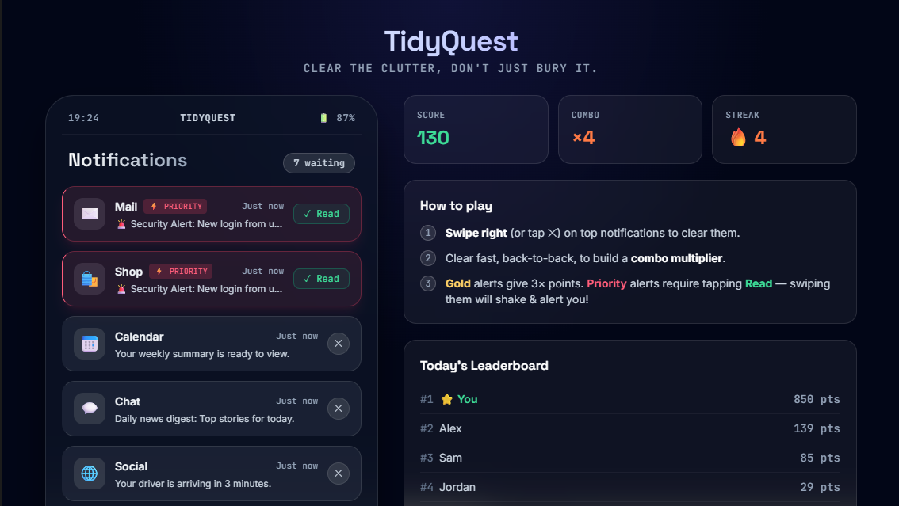
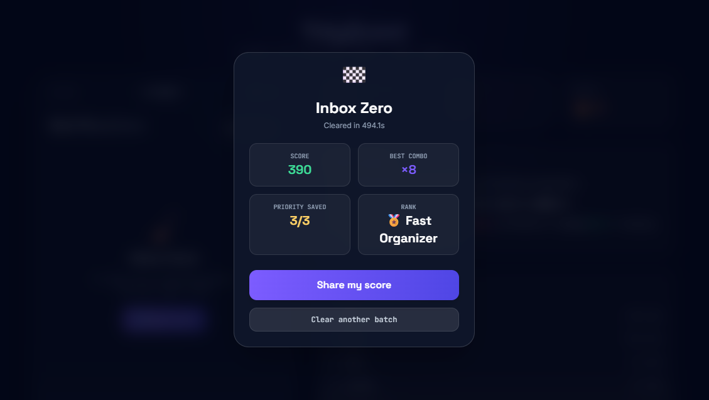

<div align="center">

# 🧹 TidyQuest

### **Clear the Clutter. Chase the Combo. Beat Your High Score.**


<br>

### 🚀 Live Demo

🌐 **https://nyc-hackathon-round-2.vercel.app/**

🧪 **https://codepen.io/Prathamesh-Thakur/pen/emgjNpb**

<br>


<br>


</div>

---

# 🎯 NYC CodeQuest 2026 Submission

## 🎨 Track

**Creative Engineering**

### Problem Statement

> **CREATIVE-01 — Make Boring Impossible**

*"Most software gets the job done but leaves no lasting impression."*

---

<table>
<tr>

<td width="33%" align="center">

## 🧹 Problem

Managing notifications is repetitive, boring and provides zero satisfaction.

</td>

<td width="33%" align="center">

## 💡 Solution

Gamify notification cleanup with rewards, combos, animations and competition.

</td>

<td width="33%" align="center">

## 🚀 Result

Users don't just clean notifications—they actually enjoy doing it.

</td>

</tr>
</table>

---

# ✨ Why TidyQuest?

Every smartphone user receives hundreds of notifications every week.

Normally users:

❌ Ignore them

❌ Clear them mindlessly

❌ Feel overwhelmed

TidyQuest transforms this boring habit into a rewarding arcade-style experience.

Instead of pressing **"Clear All"**, players:

- 🧹 Swipe notifications away
- ⚡ Build combo multipliers
- ⭐ Earn bonus points
- 🚨 Protect important alerts
- 🏆 Chase high scores
- 📤 Share achievements

---

# 🎮 Features

## Gameplay

- Swipe to dismiss notifications
- Combo multiplier
- Streak tracking
- Score system
- Victory screen
- Randomized gameplay
- Replayability

---

## Notification Types

### 📩 Normal Notifications

Regular messages worth points.

### ⭐ Gold Notifications

Bonus notifications worth **3× points**.

### 🚨 Priority Notifications

Cannot be swiped.

Must be marked as **Read** to protect important information.

---

## Visual Experience

- Glassmorphism UI
- Modern gradients
- Floating score animations
- Particle effects
- Smooth swipe interactions
- Shake animation
- Victory overlay
- Responsive layout

---

## Audio

- Swipe sound
- Combo sound
- Victory melody
- Priority alert sound

---

## Sharing

- Native Share API
- Clipboard API fallback
- Twitter/X sharing fallback

---

# 🎯 Game Mechanics

| Notification | Action | Reward |
|--------------|--------|--------|
| Normal | Swipe | +10 Points |
| Gold | Swipe | 3× Points |
| Priority | Tap Read | Protect Alert |
| Wrong Swipe | Shake Animation | No Reward |

---

# 🏗 Project Architecture

```
TidyQuest
│
├── index.html
│
├── styles.css
│     ├── Animations
│     ├── Glassmorphism
│     ├── Particle Effects
│     └── Responsive Design
│
├── script.js
│     ├── Notification Generator
│     ├── Swipe Engine
│     ├── Combo System
│     ├── Scoring Logic
│     ├── Leaderboard
│     ├── Share API
│     ├── Audio Engine
│     └── Victory Screen
│
└── README.md
```

---

# ⚙ Tech Stack

| Technology | Usage |
|------------|------|
| HTML5 | Structure |
| CSS3 | Styling |
| Vanilla JavaScript | Core Game Logic |
| TailwindCSS CDN | UI Components |
| Web Audio API | Sound |
| Clipboard API | Share Feature |
| Navigator Share API | Native Sharing |

---

# 🌟 Project Highlights

| Feature | Included |
|----------|----------|
| 🎮 Gamification | ✅ |
| 🧹 Swipe Controls | ✅ |
| ⭐ Gold Notifications | ✅ |
| 🚨 Priority Alerts | ✅ |
| ✨ Particle Effects | ✅ |
| 🔊 Audio Feedback | ✅ |
| 📱 Responsive Design | ✅ |
| 🏆 Leaderboard | ✅ |
| 📤 Share Score | ✅ |
| 🎯 Replayability | ✅ |

---

# 🚀 Live Demo

## 🌐 Vercel

https://nyc-hackathon-round-2.vercel.app/

---

## 🧪 CodePen

https://codepen.io/Prathamesh-Thakur/pen/emgjNpb

---

# ⚙ Setup & Run Instructions

## Requirements

- Modern Browser
- No Installation
- No npm
- No Build Tools

---

## Clone Repository

```bash
git clone https://github.com/yourusername/TidyQuest.git
```

---

## Open Project

```bash
cd TidyQuest
```

---

## Run

Simply open

```
index.html
```

or

Use **VS Code Live Server**.

---

# 📂 Folder Structure

```
📦 TidyQuest
│
├── 📄 index.html
├── 📄 styles.css
├── 📄 script.js
└── 📄 README.md
```

---

# 📸 Screenshots

> Replace with your own screenshots before submission.

```
screenshots/

home.png

gameplay.png

victory.png
```

---

# 🎨 UI Highlights

✅ Dark Theme

✅ Glassmorphism

✅ Animated Cards

✅ Responsive Layout

✅ Smooth Transitions

✅ Swipe Animations

✅ Particle Explosions

✅ Floating Scores

---

# 🎮 Gameplay Flow

```
Generate Notifications
        │
        ▼
 Swipe / Read Cards
        │
        ▼
 Earn Points
        │
        ▼
 Increase Combo
        │
        ▼
 Build Streak
        │
        ▼
 Inbox Zero
        │
        ▼
 Share Your Score
```

---

# 📦 Built With

- HTML5
- CSS3
- JavaScript
- TailwindCSS
- Web Audio API
- Clipboard API
- Navigator Share API

---

# 🏆 Hackathon Submission

### Event

NYC CodeQuest 2026

### Track

🎨 Creative Engineering

### Problem Statement

CREATIVE-01 — Make Boring Impossible

---

# 💡 Future Improvements

- Online Leaderboards
- Achievements
- Daily Challenges
- Themes
- Multiplayer Mode
- Mobile App
- User Profiles
- Real Notification Integration

---

# 📈 Why This Solves The Challenge

Traditional notification apps focus only on removing clutter.

TidyQuest transforms the entire experience into entertainment.

Instead of deleting notifications, users now:

- Enjoy cleaning
- Compete for higher scores
- Protect important alerts
- Experience rewarding animations
- Share achievements

This directly addresses the challenge of making everyday software memorable and enjoyable.

---

# 👨‍💻 Developer

Built with ❤️ during **NYC CodeQuest 2026**.

---

<div align="center">

## ⭐ Star this repository if you enjoyed the project!


<br>
---

---

# 📸 Preview

<div align="center">

### 🏠 Home Screen



<br><br>

### 🎮 Gameplay



</div>

---
---
---

# 👨‍💻 Developer

<div align="center">

## **Prathamesh Thakur**

🎓 Student Developer • Hackathon Enthusiast • Frontend Developer

**Team:** Emotion Emitters

**Discord:** `pratham.emotion`

</div>

---

# 🤝 Team

<div align="center">

| Team Name | Members |
|:----------:|:-------:|
| **Emotion Emitters** | **Prathamesh Thakur** |

</div>

---

# 📬 Connect

<div align="center">

💬 **Discord:** `pratham.emotion`

⭐ If you enjoyed **TidyQuest**, consider starring this repository!

</div>

---

**🧹 TidyQuest — Because boring software shouldn't exist.**

</div>
